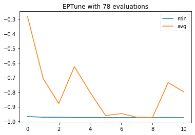
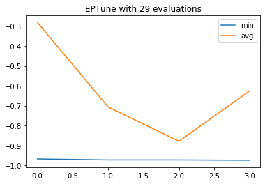

# eptune
> eptune (evolutionary parameter tuning) is a python package trying to use evolutionary computation algorithms to do parameter tuning.


## Install

`pip install eptune`

## How to use

Using following lines can fine tune MNIST dataset with 5-Fold CV performance using the `qtuneSimple` function.

```python
from eptune.sample_cases import DigitsCV
from eptune.quick import qtuneSimple
from eptune.parameter import *
from sklearn.svm import SVC

# Prameter space to search
params = [
    LogFloatParameter([0.01, 1e4], 'C'),
    CategoricalParameter(['rbf'], 'kernel'),
    LogFloatParameter([1e-6, 1e4], 'gamma')
]

# Define objective function
cv_svc_digits = DigitsCV(SVC())


def evaluate(params):
    return cv_svc_digits.cv_loss_with_params(cv=5, **params)


# Call `qtuneSimple`
population, logbook, hof = qtuneSimple(params,
                                       evaluate,
                                       n_pop=10,
                                       n_jobs=10,
                                       mutpb=0.6,
                                       cxpb=0.8,
                                       seed=42)

# Plot the logbook if needed
fig = logbook.plot(['min', 'avg'])
```

    gen	nevals	avg          	std        	min          	max          
    0  	10    	[-0.28174736]	[0.3288165]	[-0.96772398]	[-0.10072343]
    1  	7     	[-0.70684474]	[0.36593114]	[-0.97273233]	[-0.10072343]
    2  	4     	[-0.8786867] 	[0.2590384] 	[-0.97273233]	[-0.10183639]
    3  	8     	[-0.62526433]	[0.41696083]	[-0.97440178]	[-0.10072343]
    4  	8     	[-0.80116861]	[0.34319099]	[-0.97440178]	[-0.10072343]
    5  	6     	[-0.96143573]	[0.0257779] 	[-0.97440178]	[-0.89816361]
    6  	7     	[-0.9475793] 	[0.06357501]	[-0.97440178]	[-0.75959933]
    7  	6     	[-0.97250974]	[0.00531551]	[-0.97440178]	[-0.95659432]
    8  	7     	[-0.97445743]	[0.00016694]	[-0.97495826]	[-0.97440178]
    9  	8     	[-0.73567056]	[0.36697176]	[-0.97495826]	[-0.10072343]
    10 	7     	[-0.79810796]	[0.34639554]	[-0.97495826]	[-0.10072343]





The best parameters are stored in `HallofFame` object:

```python
hof
```


    [({'C': 197.75053974020003, 'kernel': 'rbf', 'gamma': 0.0005362324820364681}, (-0.9749582637729549,)), ({'C': 197.75053974020003, 'kernel': 'rbf', 'gamma': 0.00044545277111534496}, (-0.9744017807456873,))]


## Iterator Interface

An iterator interface, `qtuneIterate`, is provided in the `quick` module, so that one can treat the optimization procedure as a iterative process. When the iterator exhausted, the optimization process is ended. Following is an example:

```python
from eptune.quick import qtuneIterate
from eptune.parameter import *
# Prameter space to search
params = [
    LogFloatParameter([0.01, 1e4], 'C'),
    CategoricalParameter(['rbf'], 'kernel'),
    LogFloatParameter([1e-6, 1e4], 'gamma')
]
qi = qtuneIterate(params, n_pop=10, mutpb=0.6, cxpb=0.8, seed=42)
```

Directly call this class will return an object that can be used as an iterator.

```python
iterator = qi()
```

For each iteration, the iterator will return two elements. The first element is the parameters to be used to in the estimator or function, the other element is the Condition object used in `qtuneIterate.set_result` function.

```python
p, c = next(iterator)
p
```


    {'C': 68.63739474770763, 'kernel': 'rbf', 'gamma': 26.031847870785032}


One can do what ever you want here, such as query database, download web page, or even ask for user's input. When all the things necessary are done, one need to call `qtuneIterate.set_result` to return the control to the package and generate next parameters for next iteration.

In this example, the same function in above example is used to get the loss of the estimator with above parameters.

```python
from eptune.sample_cases import DigitsCV
from sklearn.svm import SVC
# Define objective function
cv_svc_digits = DigitsCV(SVC())


def evaluate(params):
    return cv_svc_digits.cv_loss_with_params(cv=5, **params)

loss = evaluate(p)
loss
```


    ([-0.10072342793544797], [])


After we get the loss value, we can use `qtuneIterate.set_result` to return the control to the package as follows:

```python
qi.set_result(loss, c)
```

```python
p, c = next(iterator)
p
```


    {'C': 0.2946803132334556, 'kernel': 'rbf', 'gamma': 23.15859147163727}


Repeat this process until the iterator is exhausted, then the optimization is done. In practice, you can simply use a for loop to do the job.

```python
qi = qtuneIterate(params, n_pop=10, mutpb=0.6, cxpb=0.8, ngen=3, seed=42)
for p, c in qi():
    print(f'Calculating loss for {p}')
    loss = evaluate(p)
    print(f'Loss is {loss[0]}')
    qi.set_result(loss, c)
```

    Calculating loss for {'C': 68.63739474770763, 'kernel': 'rbf', 'gamma': 26.031847870785032}
    Loss is [-0.10072342793544797]
    Calculating loss for {'C': 0.2946803132334556, 'kernel': 'rbf', 'gamma': 23.15859147163727}
    Loss is [-0.10072342793544797]
    Calculating loss for {'C': 114.8674353163588, 'kernel': 'rbf', 'gamma': 0.803387600412278}
    Loss is [-0.12186978297161936]
    Calculating loss for {'C': 0.015513010158735236, 'kernel': 'rbf', 'gamma': 0.00015359594420534672}
    Loss is [-0.1580411797440178]
    Calculating loss for {'C': 10.767917726598592, 'kernel': 'rbf', 'gamma': 0.40968553409851616}
    Loss is [-0.1018363939899833]
    Calculating loss for {'C': 197.75053974020003, 'kernel': 'rbf', 'gamma': 0.00016010548864384288}
    Loss is [-0.9677239844184753]
    Calculating loss for {'C': 34.3237004592151, 'kernel': 'rbf', 'gamma': 38.732334272432226}
    Loss is [-0.10072342793544797]
    Calculating loss for {'C': 0.09077283474940925, 'kernel': 'rbf', 'gamma': 0.002526417757312348}
    Loss is [-0.9070673344462994]
    Calculating loss for {'C': 0.08567951488560228, 'kernel': 'rbf', 'gamma': 1.0522108244005219e-05}
    Loss is [-0.1580411797440178]
    Calculating loss for {'C': 1.9035478743608165, 'kernel': 'rbf', 'gamma': 298.49953812653837}
    Loss is [-0.10072342793544797]
    gen	nevals	avg          	std        	min          	max          
    0  	10    	[-0.28174736]	[0.3288165]	[-0.96772398]	[-0.10072343]
    Calculating loss for {'C': 0.09077283474940925, 'kernel': 'rbf', 'gamma': 0.002526417757312348}
    Loss is [-0.9070673344462994]
    Calculating loss for {'C': 1140.5426263798747, 'kernel': 'rbf', 'gamma': 2.094124216624722e-06}
    Loss is [-0.9476905954368392]
    Calculating loss for {'C': 0.18445781569344738, 'kernel': 'rbf', 'gamma': 1.0522108244005219e-05}
    Loss is [-0.19031719532554256]
    Calculating loss for {'C': 2.364783608235729, 'kernel': 'rbf', 'gamma': 0.00044545277111534496}
    Loss is [-0.9727323316638843]
    Calculating loss for {'C': 0.3770940250090288, 'kernel': 'rbf', 'gamma': 9402.812584317955}
    Loss is [-0.10072342793544797]
    Calculating loss for {'C': 342.52552858536734, 'kernel': 'rbf', 'gamma': 3.979422189106964e-05}
    Loss is [-0.9538119087367836]
    Calculating loss for {'C': 37.612358782164776, 'kernel': 'rbf', 'gamma': 0.002526417757312348}
    Loss is [-0.9632721202003339]
    1  	7     	[-0.70684474]	[0.36593114]	[-0.97273233]	[-0.10072343]
    Calculating loss for {'C': 25.359556967494015, 'kernel': 'rbf', 'gamma': 1.0522108244005219e-05}
    Loss is [-0.9515859766277128]
    Calculating loss for {'C': 90.88766299120877, 'kernel': 'rbf', 'gamma': 0.18912018070990808}
    Loss is [-0.1018363939899833]
    Calculating loss for {'C': 197.75053974020003, 'kernel': 'rbf', 'gamma': 0.00016010548864384288}
    Loss is [-0.9677239844184753]
    Calculating loss for {'C': 2.364783608235729, 'kernel': 'rbf', 'gamma': 0.00044545277111534496}
    Loss is [-0.9727323316638843]
    2  	4     	[-0.8786867] 	[0.2590384] 	[-0.97273233]	[-0.10183639]
    Calculating loss for {'C': 6.340857718335152, 'kernel': 'rbf', 'gamma': 6944.6779969379}
    Loss is [-0.10072342793544797]
    Calculating loss for {'C': 1.085964509751384, 'kernel': 'rbf', 'gamma': 7.981583922628336e-05}
    Loss is [-0.9437952142459655]
    Calculating loss for {'C': 0.4691058706709815, 'kernel': 'rbf', 'gamma': 410.66817442961525}
    Loss is [-0.10072342793544797]
    Calculating loss for {'C': 9901.359072553396, 'kernel': 'rbf', 'gamma': 0.00044545277111534496}
    Loss is [-0.9744017807456873]
    Calculating loss for {'C': 2.364783608235729, 'kernel': 'rbf', 'gamma': 0.00016010548864384288}
    Loss is [-0.9593767390094602]
    Calculating loss for {'C': 197.75053974020003, 'kernel': 'rbf', 'gamma': 0.00044545277111534496}
    Loss is [-0.9744017807456873]
    Calculating loss for {'C': 0.191638955526857, 'kernel': 'rbf', 'gamma': 1.050881589158487e-06}
    Loss is [-0.15748469671675014]
    Calculating loss for {'C': 197.75053974020003, 'kernel': 'rbf', 'gamma': 9.24517286607817}
    Loss is [-0.10127991096271564]
    3  	8     	[-0.62526433]	[0.41696083]	[-0.97440178]	[-0.10072343]


After the iteration, the `qtuneIterate` instance store the results in itself.

```python
qi.population
```


    [{'C': 6.340857718335152, 'kernel': 'rbf', 'gamma': 6944.6779969379},
     {'C': 1.085964509751384, 'kernel': 'rbf', 'gamma': 7.981583922628336e-05},
     {'C': 0.4691058706709815, 'kernel': 'rbf', 'gamma': 410.66817442961525},
     {'C': 9901.359072553396, 'kernel': 'rbf', 'gamma': 0.00044545277111534496},
     {'C': 2.364783608235729, 'kernel': 'rbf', 'gamma': 0.00016010548864384288},
     {'C': 197.75053974020003, 'kernel': 'rbf', 'gamma': 0.00044545277111534496},
     {'C': 0.191638955526857, 'kernel': 'rbf', 'gamma': 1.050881589158487e-06},
     {'C': 197.75053974020003, 'kernel': 'rbf', 'gamma': 9.24517286607817},
     {'C': 2.364783608235729, 'kernel': 'rbf', 'gamma': 0.00044545277111534496},
     {'C': 197.75053974020003, 'kernel': 'rbf', 'gamma': 0.00016010548864384288}]


```python
qi.hof
```


    [({'C': 197.75053974020003, 'kernel': 'rbf', 'gamma': 0.00044545277111534496}, (-0.9744017807456873,)), ({'C': 9901.359072553396, 'kernel': 'rbf', 'gamma': 0.00044545277111534496}, (-0.9744017807456873,))]


```python
fig = qi.logbook.plot(['min', 'avg'])
```





## More control

If you want more control, you can check:
1. `eptune.sklearn` module provides `ScikitLearner` or `ScikitLearnerCV` for fine tune parameter of estimators with scikit learn API. Examples are also provided in the documentation.
2. `eptune.algorithms` module provides algorithms to access the DEAP framework directly.
